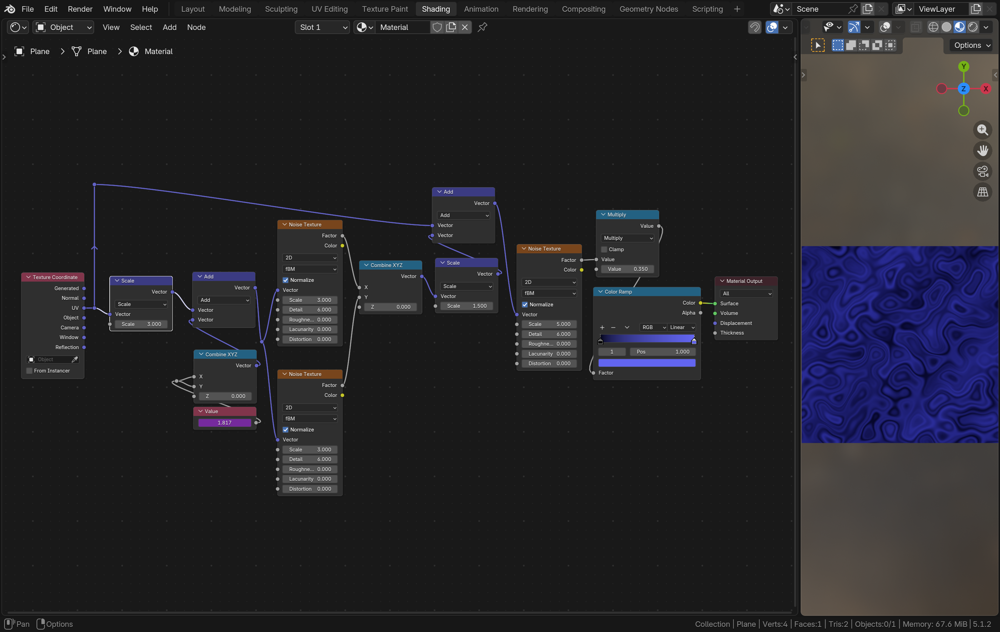

I've been interested in 3D graphics since 2018, ever since I found out the amazing software Blender is free and open-source. Modeling, lighting, and rendering are mostly subject to artistic taste and capability. Shading however, involves a little bit of "programming". Blender offers a node-based approach to designing shaders. It's kind of programming but you're not writing code (you _could_ in fact write code, in the form of GLSL shaders, but that's a story for some other day). Here's a rough recreation of the background shader in Blender.

 * Note the noise textures use fBM (fractal brownian motion) noise. This is exactly what we've recreated in the background shader, with implementation help from [The Book of Shaders](https://thebookofshaders.com/13/) and Claude.
 * The shader in Blender is also animated (via the magenta "Value" node).
 * It's a rough recreation because the Blender noise texture node provides more knobs to configure, and my shader takes certain shortcuts.

I'll endeavor to implement some of my favorite Blender textures in GLSL as well. There are a few accounts on Instagram dedicated to creating procedural art using GLSL that inspire me to explore the same. Seems right up my alley!